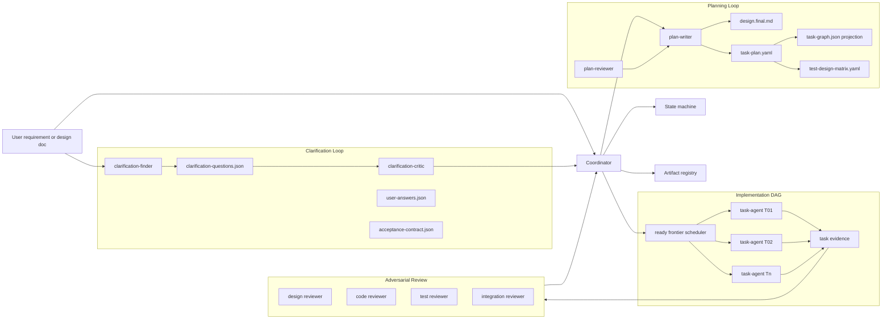
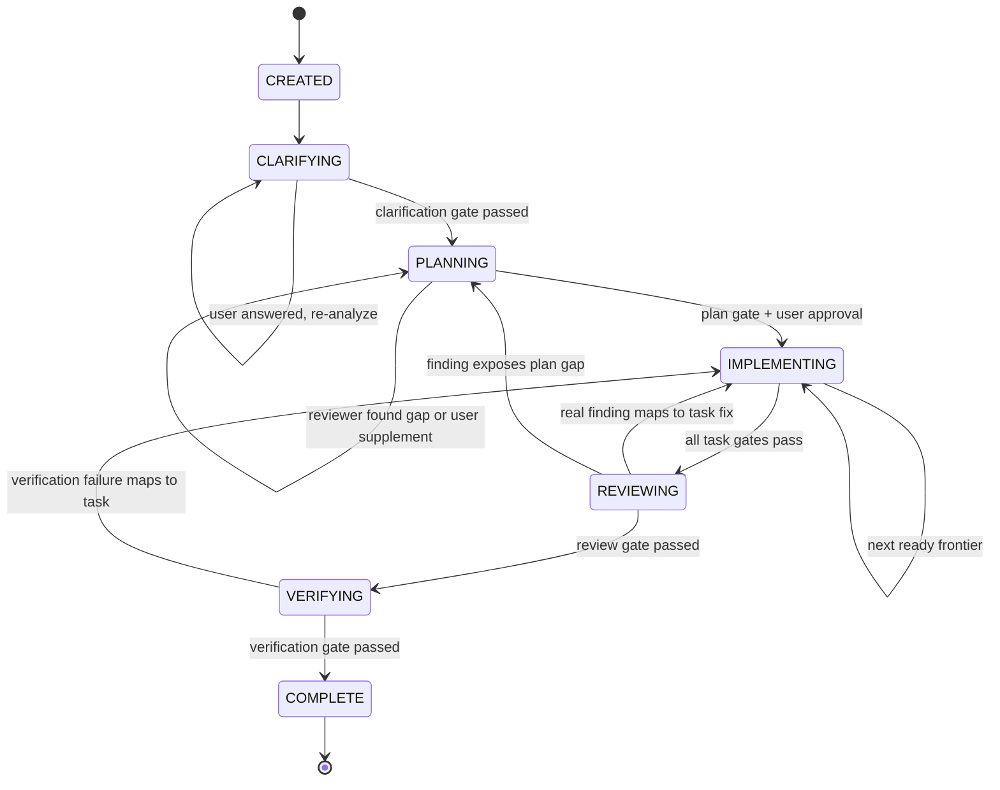
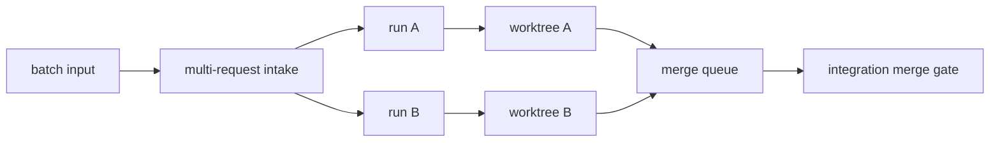

# Loop Engineering 详细实现设计方案

更新时间: 2026-06-25

## 0. 信任与执行模型

> 本节是全方案的认识论地基, 先于功能设计确立。后续所有 gate、evidence schema、worker 约束都以本节为裁决依据; 与本节冲突的下游条款以本节为准。

### 0.1 为什么信任模型必须前置

本方案的核心价值主张是"不靠 prose 判断是否完成"(§1 目标 2)。但产出证据的主要参与方是 LLM worker, 属于不可信生产者。如果 gate 只校验"字段是否存在", 而事实字段 (如 `exit_code`) 由 worker 自己写, 那么客观门禁只是把"声明"从聊天载体换成了 JSON 载体, 防伪强度并未提升。

因此进入任何功能设计前必须先回答三个问题:

1. 谁可信, 谁不可信。
2. 哪些证据是事实, 哪些是判断。
3. 信任边界靠什么强制——机制还是约定。

本节的结论一旦确立, 后续 gate / evidence / worker skill 约束都只是它的推论。

### 0.2 执行体三分

| 执行体 | 信任假设 | 可写 | 不可写 / 禁止 |
| --- | --- | --- | --- |
| Gate engine | 可信, 确定性代码 | `gate-result` | 不做语义判断, 不依赖聊天上下文 |
| Coordinator | 半可信编排者 | `run-state`、`command-evidence`、`events` | 不裁决 gate 通过与否, 不替 worker 写产物 |
| Worker (LLM) | **不可信生产者** | 自己 task 目录下的 claim 与 code diff | `run-state`、`command-evidence`、`events.actor`; 不调度 sibling; 不写事实型字段 |

唯一的状态推进权威是 gate engine。coordinator 可以执行命令采集事实, 但不能决定 gate 是否通过; worker 只能提交待裁决的材料。

### 0.3 Evidence 二分: 事实型与判断型

所有 evidence 必须先归类, 再决定由谁产出、gate 如何校验。

| 类别 | 例子 | 产出者 | gate 校验方式 |
| --- | --- | --- | --- |
| 事实型 | `exit_code`、`changed_files`、diff、命令输出 hash | coordinator / 独立 collector | 可对关键命令独立重放或校验输出 hash |
| 判断型 | review verdict、finding severity、summary 是否充分、测试是否空壳 | 独立 reviewer agent | 只校验 verdict 存在且 schema 合法、必填字段齐全 |

两条铁律:

1. **事实型字段绝不出现在 worker 的可写产物里。** worker 提交"建议运行哪些命令", 由 coordinator 运行并写入真实结果。
2. **gate 绝不自己做语义判断。** 凡是"测试是否空壳""summary 是否讲清""断言字段是否可检查"这类判断, 一律转为独立 reviewer 产结构化 verdict, gate 只读 verdict 字段。

### 0.4 信任边界的强制手段 (分级)

```text
能隔离   -> 用文件/进程写权限强制 (worker 无 run-state 与 command-evidence 写权限)
不能隔离 -> 在本文档显式声明该处为"结构完整性校验", 不得宣称防伪
```

implementation-worker skill 的写约束 (§12.3) 与 events `actor` 不可伪造 (§5) 凡能落到运行时写授权或只读白名单的, 必须落地为机制; 暂时落不了的, 必须在 §14 风险中显式标注为软约束残余, 不能默认它已生效。

### 0.4.1 Worker 运行时权限基线

本文档不再把"子智能体天然隔离"作为前提。worker 隔离必须由 runtime 显式配置, 并作为 task gate 的输入证据。

implementation-worker 的默认权限基线:

```yaml
schema: loop-engineering.worker-permission-profile.v1
role: implementation-worker
read_allow:
  - run-state.json
  - planning/design.final.md
  - planning/task-plan.yaml
  - tasks/{task_id}/task-contract.json
  - tasks/{task_id}/test-design.yaml
write_allow:
  - tasks/{task_id}/task-run-request.json
  - tasks/{task_id}/implementation-diff.json
  - tasks/{task_id}/worker-summary.md
  - {task_allowed_write_paths}
write_deny:
  - run-state.json
  - events.jsonl
  - artifacts/index.json
  - verification/command-evidence/**
  - tasks/*/red-tests.json
  - tasks/*/passing-tests.json
tool_allow:
  - read_context
  - edit_allowed_paths
  - propose_commands
tool_deny:
  - append_event
  - write_command_evidence
  - mutate_run_state
  - dispatch_subagent
```

调度 worker 前, coordinator 必须把实际 runtime 授权写入:

```json
{
  "schema": "loop-engineering.runtime-permission-attestation.v1",
  "task_id": "T01",
  "profile": "implementation-worker",
  "write_allow": ["tasks/T01/**", "src/clarification/**", "tests/clarification/**"],
  "write_deny": ["run-state.json", "events.jsonl", "verification/command-evidence/**"],
  "tool_allow": ["read_context", "edit_allowed_paths", "propose_commands"],
  "attested_by": "coordinator"
}
```

若当前宿主不能提供等价的 tool/file 写授权, 本 run 必须设置:

```json
{
  "schema": "loop-engineering.trust-mode.v1",
  "trust_mode": "structural_integrity_only",
  "reason": "worker runtime cannot enforce write-deny boundaries"
}
```

在 `structural_integrity_only` 模式下, 文档和最终报告只能声称"结构完整性校验 + 抽样重放", 不得声称已消除 worker 自报完成风险。

### 0.5 关键决策: 命令证据采集归属 (本版裁定)

这是全方案总枢纽——它决定"不靠 prose 判断完成"是真命题还是降级承诺。

```json
{
  "schema": "loop-engineering.trust-decision.v1",
  "decision_id": "TD-001-command-evidence-collector",
  "decision": "collector = coordinator",
  "rationale": "主 agent 具备直接执行命令的能力, 采集发生在被审 worker 之外, 信任边界由写权限强制而非约定",
  "model": "worker 提交 task-run-request 建议命令, coordinator 执行并写 command-evidence, gate 对 red/green/verification/integration 关键命令独立重放或校验 hash",
  "fallback": "若部署环境中 coordinator 无法独立执行命令, 必须把防伪降级为结构完整性校验加抽样重放, 并在 §1 与 §14 显式声明本版不宣称消除自然语言声明",
  "owner_to_confirm": "design owner"
}
```

采用本裁定后, §9.3 / §9.4 的 task evidence 必须据此重构: worker 的 `expected_outputs` 不再包含 `passing-tests.json` 这类含 `exit_code` 的事实产物, 改为 worker 产 `task-run-request`、coordinator 产 `command-evidence`。

### 0.6 本节如何贯穿下游

本节不是孤立声明, 下列章节必须据此修订才算生效:

| 本节条款 | 约束的下游章节 |
| --- | --- |
| 0.2 gate = 确定性代码 | §7.5 / §8.8–8.10 / §9.5 / §10 各 gate 通过条件 |
| 0.3 事实型由 coordinator 产出 | §9.3 worker packet、§9.4 task evidence |
| 0.3 判断型降级为 verdict | §8.9 test-design gate、§9.5「summary 短」、§10 review |
| 0.4 写授权强制 | §5 events.actor、§12.3 implementation-worker skill |
| 0.4.1 runtime 权限证明 | §9.3 worker packet、§9.5 task gate、§12.3 implementation-worker skill |

下游章节在引用上述概念时, 应回指本节, 不再各自重新定义。

## 1. 背景与目标

Loop Engineering 是一个面向复杂软件需求的多 agent 工程闭环。输入可以是一句话需求, 也可以是一份需求/设计文档。系统通过固定阶段推进:

```text
澄清 -> 创建计划 -> 实施 -> 审核 -> 验证完成
```

核心目标:

1. 主 agent 只负责编排、状态推进和用户沟通, 保持上下文少而干净。
2. 每个阶段都有明确产物、状态机和 gate, 不靠 prose 判断是否完成。
3. 澄清阶段使用双 agent: 一个找必要澄清问题, 一个审核这些问题是否真的必要。
4. Plan 阶段使用双 agent: 一个写设计和拆任务, 一个审核设计、任务拆分、测试设计和风险。
5. 复杂需求必须拆成多个隔离 task, 渐进式开发, 避免一个开发 agent 背负过多上下文。
6. Plan 阶段不仅拆 task, 还要把每个 task 的用例设计、测试逻辑、校验方法、断言字段写进 YAML。
7. 实施阶段按 task DAG 调度, 每个 task 对应独立 subagent; 有依赖或冲突的 task 必须阻塞。
8. Review 阶段使用多个 adversarial reviewer 对抗式审视, high/critical finding 必须结构化处理。
9. 支持多需求文档并行开发: 一个需求文档对应一个 run、branch、worktree, 最终进入 merge queue 和 integration gate。

非目标:

1. 不让主 agent 读取所有 worker 长输出。
2. 不把所有 task 塞给一个开发 agent 一次性实现。
3. 不让 gate 变成形式化打勾; gate 必须校验产物、状态和证据。
4. 不把用户拖进每个内部断言字段的审核; 只有验收语义变化时才问用户。

## 2. 总体原则

### 2.1 Artifact-first

所有阶段产物都写入 run 目录, 主 agent 只读摘要、hash、状态和必要路径。worker 的长推理、长日志和命令输出进入 artifact, 不进入主上下文。

### 2.2 State-machine-first

状态机是推进依据。任何阶段不能通过口头声明跳转, 必须满足当前 phase 的 gate。

### 2.3 Skill-first, Gate-as-backstop

复杂需求拆分、测试设计、渐进式开发优先写进 worker skill 指导 agent 主动做好。Gate 负责兜底: 如果 agent 没做到, 就阻塞推进。这样能减少摩擦, 又不牺牲质量。

### 2.4 Progressive task DAG

复杂需求必须拆成多个小 task, 每个 task 有边界、依赖、写范围、验收项和测试设计。实施只 dispatch 当前 ready frontier, 当前批次通过 task gate 后再解锁后续 task。

### 2.5 Test design before implementation

Plan 阶段必须生成测试设计, 不允许 implementation worker 临场发明验收口径。每个 task worker 拿到的是:

```text
做什么 + 改哪些路径 + 依赖谁 + 需要哪些证据 + 用哪些用例证明完成 + 断言哪些字段
```

### 2.6 Gate Policy 与摩擦预算

Gate 不是为了让 agent 互相否决, 而是为了防止无法证明的完成状态进入下一阶段。所有 gate 都必须先做分级, 再决定是否阻塞。

| 等级 | 是否阻塞 | 定义 | 示例 |
| --- | --- | --- | --- |
| hard | 阻塞 | 不修会导致状态非法、证据不可审计、AC 无法证明或并发/合并不安全 | schema 不合法、依赖缺失、AC 无 test case、assert_fields 缺失、越权改文件 |
| soft | 不阻塞, 记录到风险或 follow-up | 不修会降低可维护性或测试质量, 但当前验收仍可证明 | task 命名不够清晰、测试粒度可更细、非关键文档缺例子 |
| advisory | 不阻塞, 只作为建议 | reviewer 偏好、风格建议、未来优化 | 更优抽象、日志文案微调、非必要 refactor |

摩擦控制规则:

1. reviewer 想发出 hard finding, 必须证明 blocking value: 不修会破坏哪条 AC、哪个状态、哪个 gate 或哪份证据。
2. gate 只能检查可判定事实, 不检查“设计是否优雅”这类偏好。
3. 同一 phase 连续 repair 最多 2 轮。超过预算后进入 coordinator arbitration, 不继续让 writer/reviewer 自循环。
4. arbitration 只做三选一: 降级为 soft/advisory、生成最小 repair、请求用户裁决。
5. implementation worker 发现 planned test case 或 assert_fields 不可执行时, 走 plan amendment 快路径, 只重审受影响 task, 不重开整个 plan。
6. simple/medium/complex 使用不同 gate 强度; simple 需求不得套用 complex/control-plane 的完整负向矩阵。
7. 每个 run 必须有总调用预算和单阶段预算。预算耗尽时进入 `budget_exhausted` arbitration, 只能选择最小修复、降级为人工裁决、或停止本 run, 不允许继续自动 fan-out。
8. 对抗式 reviewer 初版若使用 N=1, 只能声明"单审查员 + 完整性检查", 不得使用多数票、独立共识或消除共享盲点这类措辞。

预算基线:

```yaml
schema: loop-engineering.budget-policy.v1
max_total_agent_calls: 24
phase_limits:
  CLARIFYING: 4
  PLANNING: 6
  IMPLEMENTING: 2_per_ready_task
  REVIEWING: 6
  VERIFYING: 2
repair_round_limit_per_phase: 2
reviewer_fanout:
  mvp: 1
  full: 4
on_exhausted: coordinator_arbitration
```

Gate evaluation schema:

```json
{
  "schema": "loop-engineering.gate-evaluation.v1",
  "gate": "plan-gate",
  "verdict": "blocked",
  "hard_findings": [
    {
      "id": "G-001",
      "claim": "AC-003 has no planned test case",
      "blocking_value": "AC-003 cannot be proven before implementation",
      "route": "plan_repair"
    }
  ],
  "soft_findings": [],
  "advisory_findings": [],
  "repair_round": 1,
  "repair_budget_remaining": 1,
  "next_action": "dispatch_plan_writer_repair"
}
```

## 3. 总体架构



## 4. 状态机



状态字段:

```json
{
  "run_id": "20260625-001",
  "request_id": "REQ-001",
  "current_phase": "PLANNING",
  "phase_status": "reviewing",
  "allowed_next_actions": ["dispatch_plan_repair"],
  "blocked_reasons": [],
  "repair_budget": {
    "CLARIFYING": 2,
    "PLANNING": 2,
    "IMPLEMENTING": 2,
    "REVIEWING": 2
  },
  "active_tasks": [],
  "artifact_index_path": "artifacts/index.json",
  "plan_hash": null,
  "worktree_binding_path": null
}
```

## 5. Run 目录与 Artifact

```text
runs/<run_id>/
  run-state.json
  events.jsonl
  gate-policy.json
  artifacts/index.json
  input/
    requirement.md
    normalized-requirement.json
  clarification/
    clarification-questions.round-001.json
    clarification-critic.round-001.json
    user-answers.round-001.json
    acceptance-contract.json
    clarification-review.json
  planning/
    design.draft-001.md
    plan-review.round-001.json
    design.final.md
    task-plan.yaml
    task-graph.json
    test-design-matrix.yaml
    acceptance-matrix.json
    complexity-assessment.json
    risk-register.json
    isolation-plan.json
    user-plan-approval.json
  tasks/
    T01/
      task-contract.json
      test-design.yaml
      worker-packet.json
      task-run-request.json      # worker 产 (claim)
      implementation-diff.json   # worker 产
      worker-summary.md          # worker 产
      red-tests.json             # coordinator 产, 引用 command-evidence
      passing-tests.json         # coordinator 产, 引用 command-evidence
    T02/
      ...
  review/
    adversarial-review.r1.json
    adversarial-review.r2.json
    finding-verdicts.json
  runtime/
    worker-permission-profile.yaml
    runtime-permission-attestation.json
    trust-mode.json
  verification/
    command-evidence/
    final-verification-report.json
    scope-manifest.json
```

### 5.1 `artifacts/index.json`

artifact 索引登记每个产物的 hash、产出者和阶段, 供 gate 校验产物存在且未被篡改:

```json
{
  "schema": "loop-engineering.artifact-index.v1",
  "run_id": "20260625-001",
  "entries": [
    {
      "key": "planning/task-plan.yaml",
      "path": "planning/task-plan.yaml",
      "sha256": "...",
      "produced_by": "plan-writer",
      "phase": "PLANNING",
      "updated_at": "2026-06-25T00:00:00Z"
    }
  ]
}
```

### 5.2 `events.jsonl` 认证信封

`events.jsonl` 是审计时间线, 因此不能只依赖事件体里的 `actor` 字符串。每条 event 必须由 coordinator 独占写入端追加, 并带前序 hash 与写入者证明:

```json
{
  "schema": "loop-engineering.event-envelope.v1",
  "sequence": 42,
  "run_id": "20260625-001",
  "actor": "coordinator",
  "event_type": "task_gate_passed",
  "payload_hash": "sha256:...",
  "prev_event_hash": "sha256:...",
  "event_hash": "sha256:...",
  "written_by": "coordinator-event-writer",
  "written_at": "2026-06-25T00:00:00Z"
}
```

MVP 可以暂不引入外部签名服务, 但不能暂缓 `sequence`、`prev_event_hash`、`event_hash`、`written_by` 四个字段。若宿主不能保证 worker 无法写 `events.jsonl`, 则该 run 必须进入 `structural_integrity_only` 模式, 且 `events.jsonl` 不得作为不可伪造 witness 使用。

### 5.3 SSOT 与写一致性协议

三个 projection 职责正交, 各自是某一维度的权威:

| projection | 权威维度 | 冲突时 |
| --- | --- | --- |
| `run-state.json` | 当前状态 (phase / status / 调度) | 状态以它为准 |
| artifact + `artifacts/index.json` | 内容与证据 | 内容以 artifact 实体 + hash 为准 |
| `events.jsonl` | 发生过什么 (审计时间线) | 历史以它为准 |

写协议:

1. 单写者: 只有 coordinator 写 `run-state.json`、`events.jsonl` 与 `artifacts/index.json`; worker 只写自己 task 目录下的 claim 产物和被授权代码路径。
2. 原子写: 先写临时文件并 fsync, 再 rename 覆盖目标 (同卷 rename 原子), 避免半写状态。
3. 写序: 先落 artifact 实体文件 -> 再更新 index (含 hash) -> 再 append 认证 event -> 最后更新 run-state。
4. 崩溃恢复: 以带 hash 链的 `events.jsonl` 与 artifact 实体重建/校验 index 与 run-state; 若 run-state 比 events 旧, 以已验证 event 重放结果修复 run-state。
5. 恢复前置校验: event hash 链断裂、`written_by` 非 coordinator、或 artifact hash 不匹配时, recover 只能进入诊断模式, 不得自动推进 phase。

这样在并发与崩溃下, SSOT 不会停留在不可信的中间态。

## 6. Coordinator 设计

Coordinator 只做编排和用户沟通, 不做长上下文实现。

职责:

1. 维护 `run-state.json`。
2. 根据 state 和 gate 结果 dispatch worker。
3. 给每个 worker 提供最小 packet。
4. 收集 worker artifact path 和摘要。
5. 向用户提出必要问题。
6. 阻止非法 phase transition。
7. 维护 repair budget 和 arbitration。
8. 保持 compact summary。

Coordinator summary 示例:

```markdown
# Coordinator Summary

Current phase: PLANNING
Phase status: reviewing
Last gate: failed
Blocking reason: T02-CASE-001 missing assert_fields
Next legal action: dispatch plan-writer repair

Important artifacts:
- planning/design.draft-002.md
- planning/task-plan.yaml
- planning/plan-review.round-002.json

User pending: no
```

## 7. 澄清阶段

### 7.1 双 agent

`clarification-finder` 负责识别必要澄清点。它不能为了完美而提问, 只能问会影响设计、任务拆分、测试或风险判断的问题。

`clarification-critic` 负责审核这些问题是否必要。它要删除无必要问题, 合并重复问题, 并给出是否可以使用默认假设继续。

### 7.2 问题 schema

```json
{
  "schema": "loop-engineering.clarification-questions.v1",
  "round": 1,
  "questions": [
    {
      "id": "Q1",
      "question": "目标系统的主要用户是谁?",
      "reason": "影响权限模型和测试场景",
      "blocks_acceptance_contract": true,
      "default_if_unanswered": null
    }
  ]
}
```

### 7.3 critic schema

```json
{
  "schema": "loop-engineering.clarification-critic.v1",
  "verdict": "needs_user_answer",
  "approved_questions": ["Q1"],
  "rejected_questions": [
    {
      "id": "Q2",
      "reason": "nice-to-have, does not affect next phase"
    }
  ]
}
```

### 7.4 用户回答后的 re-loop

用户回答后不能直接进入 planning。必须再次 dispatch finder 和 critic:

```text
user answers -> finder re-analyzes -> critic re-checks -> clarification gate
```

这样可以处理“回答引出新问题”的情况。

### 7.5 Clarification gate

通过条件:

1. `clarification-questions.json` schema 合法。
2. critic verdict 为 `approved` 或 `no_questions_needed`。
3. 所有 blocker 问题都有用户回答或明确默认假设。
4. `acceptance-contract.json` 存在。
5. 没有 unresolved critical ambiguity。

## 8. Plan 阶段

Plan 阶段是本系统最关键的阶段。它不是简单写一个设计文档, 而是产出后续实施和审核的完整契约。

### 8.1 Plan loop

```text
dispatch plan-writer and plan-reviewer
plan-writer writes design + task-plan.yaml
plan-reviewer reviews design + decomposition + test design
if findings exist:
  dispatch plan-writer repair
  dispatch plan-reviewer re-review
else:
  ask user whether to supplement
```

### 8.2 plan-writer 输出

```text
planning/design.draft-N.md
planning/task-plan.yaml
planning/task-graph.json
planning/test-design-matrix.yaml
planning/complexity-assessment.json
planning/acceptance-matrix.json
planning/risk-register.json
planning/isolation-plan.json
planning/test-strategy.md
```

### 8.3 `task-plan.yaml` 主契约

`task-plan.yaml` 是 Plan 阶段的核心产物。它要同时描述 task 拆分、依赖、隔离、验收映射、用例设计、测试逻辑、校验方法和断言字段。

示例:

```yaml
schema: loop-engineering.task-plan.v1
version: 1
decomposition_policy:
  complexity: complex
  implementation_mode: progressive-task-dag
  reason: bounded worker context and explicit verification

tasks:
  - id: T01
    title: Implement clarification gate validators
    description: Validate clarification finder and critic artifacts before entering planning
    task_size: small
    single_responsibility: true
    task_type: feature   # feature | infrastructure
    infrastructure_reason: null
    exclusive: false
    depends_on: []
    acceptance_refs: [AC-001, AC-002]
    allowed_write_paths:
      - src/clarification/**
      - tests/clarification/**
    conflict_groups: [clarification-gates]
    required_evidence:
      - red_tests
      - implementation_diff
      - passing_tests
      - task_summary
    can_run_parallel: true
    test_design:
      required: true
      coverage_refs: [AC-001, AC-002]
      cases:
        - id: T01-CASE-001
          type: unit
          scenario: valid finder and critic artifacts pass clarification gate
          acceptance_refs: [AC-001]
          red_first: true
          setup:
            artifacts:
              - clarification/clarification-questions.round-001.json
              - clarification/clarification-review.json
          action:
            command: python -m pytest tests/clarification/test_gate.py -q
          validation:
            method: assert_gate_result
            assert_fields:
              - passed
              - missing_evidence
              - blocked_reasons
            assertions:
              passed: true
              missing_evidence: []
              blocked_reasons: []
          expected_evidence:
            red: tasks/T01/red-tests.json
            green: tasks/T01/passing-tests.json
        - id: T01-CASE-002
          type: negative
          scenario: rejected critic verdict blocks clarification gate
          acceptance_refs: [AC-002]
          red_first: true
          action:
            command: python -m pytest tests/clarification/test_gate.py -q
          validation:
            method: assert_gate_result
            assert_fields:
              - passed
              - blocked_reasons
            assertions:
              passed: false
              blocked_reasons_contains:
                - clarification_review_not_approved
          expected_evidence:
            red: tasks/T01/red-tests.json
            green: tasks/T01/passing-tests.json
```

设计约束:

1. `task-plan.yaml` 是人工审核和 worker packet 的输入源。
2. `task-graph.json` 如存在, 必须由 `task-plan.yaml` 派生并校验 hash 一致。
3. `test-design-matrix.yaml` 可以从 task 的 `test_design` 汇总生成。
4. implementation worker 不得擅自删除、弱化或改名 planned case。
5. 如果 planned case 不可执行或断言字段错误, worker 必须请求 `plan-amendment.json`, 回到 PLANNING 修复。

### 8.4 `task-graph.json` 投影

`task-graph.json` 只给调度器使用, 不作为人工主契约。投影字段:

```json
{
  "schema": "loop-engineering.task-graph.v1",
  "source": "planning/task-plan.yaml",
  "source_hash": "...",
  "tasks": [
    {
      "id": "T01",
      "depends_on": [],
      "allowed_write_paths": ["src/clarification/**", "tests/clarification/**"],
      "conflict_groups": ["clarification-gates"],
      "exclusive": false,
      "can_run_parallel": true
    }
  ]
}
```

### 8.5 `complexity-assessment.json`

```json
{
  "schema": "loop-engineering.complexity-assessment.v1",
  "classification": "complex",
  "triggers": [
    "multiple acceptance criteria",
    "state-machine behavior",
    "parallel worker scheduling",
    "review and verification gates"
  ],
  "required_decomposition": true,
  "minimum_task_count": 3,
  "implementation_mode": "progressive-task-dag",
  "friction_policy": {
    "simple_requests_may_use_single_task": true,
    "complex_requests_must_pass_decomposition_gate": true,
    "user_confirmation_required_for_each_task": false
  }
}
```

### 8.6 `acceptance-matrix.json`

```json
{
  "schema": "loop-engineering.acceptance-matrix.v1",
  "links": [
    {
      "acceptance_id": "AC-001",
      "tasks": ["T01"],
      "planned_test_cases": ["T01-CASE-001", "T01-CASE-002"],
    "permission_attestation": "runtime/runtime-permission-attestation.json",
      "assert_fields": ["passed", "missing_evidence", "blocked_reasons"],
      "test_evidence": ["T01:red_tests", "T01:passing_tests"],
      "review_evidence": ["adversarial-test-review"]
    }
  ]
}
```

### 8.7 plan-reviewer 输出

```json
{
  "schema": "loop-engineering.plan-review.v1",
  "round": 1,
  "verdict": "needs_repair",
  "decomposition_review": {
    "verdict": "needs_repair",
    "oversized_tasks": ["T02"],
    "missing_dependencies": ["T03 -> T01"],
    "context_risk": "high"
  },
  "test_design_review": {
    "verdict": "needs_repair",
    "missing_test_design_tasks": ["T04"],
    "acceptance_without_case": ["AC-006"],
    "cases_missing_assert_fields": ["T02-CASE-001"],
    "weak_validation_methods": ["manual prose check"]
  },
  "findings": [
    {
      "id": "PF-001",
      "severity": "high",
      "category": "task-dependency",
      "claim": "T03 uses gate infrastructure produced by T01 but does not depend on T01",
      "evidence": ["planning/task-plan.yaml"],
      "required_fix": "Add T01 to T03.depends_on"
    }
  ],
  "coverage": {
    "all_acceptance_criteria_mapped": true,
    "all_tasks_have_evidence": true,
    "all_tasks_have_test_design": false,
    "all_parallel_tasks_have_isolation": false
  }
}
```

### 8.8 Decomposition gate

复杂需求必须通过拆分门禁。通过条件:

1. `complexity-assessment.json` 存在。
2. complex 需求的 implementation mode 为 `progressive-task-dag`。
3. 每个 task 有单一职责。
4. 每个 task 有明确 `acceptance_refs`, 或显式标记 `task_type: infrastructure` (与 §8.10 第9条统一)。
5. 每个 task 有 `depends_on`, 即使为空数组。
6. 每个 task 有 `allowed_write_paths` 和 `conflict_groups`。
7. 每个 task 有 required evidence。
8. plan-reviewer 的 `decomposition_review.verdict` 为 `approved`。
9. oversized task 必须被拆分, 或有明确不可拆理由。
10. dispatch 必须按 batch/ready frontier 推进。

### 8.9 Test-design gate

Plan 阶段不仅要拆 task, 还要为每个 task 写出测试/用例设计。

通过条件:

1. 每个 implementation task 都有 `test_design.required = true`, 或有 plan 批准的免测理由。
2. 每个 acceptance criterion 至少被一个 `cases[].acceptance_refs` 覆盖。
3. 每个 case 有 `scenario`、`validation.method`、`validation.assert_fields` 和 `assertions`。
4. 复杂/控制面/状态机 task 必须至少包含一个负向或失败路径 case。
5. `assert_fields` 必须指向可检查字段、状态、响应 key、artifact key 或 UI 状态。
6. plan-reviewer 的 `test_design_review.verdict` 必须为 `approved`。
7. implementation worker 不得擅自删除、弱化或改名 planned case。

摩擦控制:

1. 用户不需要逐条审核断言字段。
2. simple 需求可以只要求一个 happy-path case 和一个明确验证方法。
3. 只有测试设计改变用户验收语义时, 主 agent 才问用户。

### 8.10 Plan gate

Plan gate 先生成 `gate-evaluation.json`。只有 hard findings 会阻塞进入 IMPLEMENTING; soft/advisory findings 进入 risk register 或 follow-up, 不触发 writer/reviewer 无限返工。

通过条件:

1. `design.final.md` 或 latest draft 存在。
2. `task-plan.yaml` schema 合法。
3. 如存在 `task-graph.json`, 它必须由 `task-plan.yaml` 派生且 hash 一致。
4. `complexity-assessment.json` 存在, 且复杂度分类与实施模式一致。
5. Decomposition gate 通过。
6. Test-design gate 通过。
7. task id 唯一。
8. `depends_on` 不成环。
9. 每个 task 至少映射一个 acceptance criterion; `task_type: infrastructure` 的任务必须填写 `infrastructure_reason` 并映射到至少一个后续 task 或 gate 能力。
10. 每个 acceptance criterion 至少被一个 task 和一个 planned test case 覆盖。
11. 每个 task 有 required evidence。
12. 每个 planned case 有 validation method、assert fields 和 expected evidence。
13. 可并行 task 没有重叠 `allowed_write_paths` 或共享 `conflict_groups`。
14. `plan-reviewer` verdict 和 `test_design_review.verdict` 均为 `approved`。
15. high/critical plan finding 全部 resolved 或 refuted。
16. hard finding 均有 blocking value, 且未超过 PLANNING repair budget。

### 8.11 用户补充 gate

Plan gate 通过后, 主 agent 问用户:

```text
设计、任务拆分和测试设计已经通过内部审核。是否需要补充或修改设计?
```

如果用户补充, 保持 `current_phase = PLANNING`, 写入 `user-plan-supplement.json`, 重新进入 plan loop。

如果用户不补充, 写入:

```json
{
  "schema": "loop-engineering.user-plan-approval.v1",
  "decision": "approved",
  "approved_design_hash": "...",
  "approved_task_plan_hash": "...",
  "approved_test_design_hash": "..."
}
```

随后冻结 plan hash, 进入 IMPLEMENTING。实施阶段只能基于冻结计划工作。任何后续目标变化必须创建 `plan-amendment.json` 并重新过 Plan gate。

## 9. 实施阶段

### 9.1 Task 调度模型

实施阶段由 `task-plan.yaml` 派生的 task DAG 驱动。调度器每轮计算 ready frontier。

```python
def ready_frontier(tasks, active_tasks):
    ready = []
    committed = list(active_tasks)   # 已占用资源: active + 本批已选入
    for task in tasks:
        if task.status != "pending":
            continue
        if not all(tasks[d].status == "complete" for d in task.depends_on):
            block(task, "dependency-not-complete")
            continue
        if not required_upstream_artifacts_exist(task):
            block(task, "missing-upstream-artifact")
            continue
        # 关键: 不仅与 active 比, 还要与本批已选候选两两比,
        # 否则同批写范围重叠的 task 会被一起派发并互相覆盖
        if any(conflicts(task, other) for other in committed):
            block(task, "conflict-with-committed-task")
            continue
        if not task.can_run_parallel and committed:
            block(task, "must-run-exclusive")
            continue
        ready.append(task)
        committed.append(task)       # 选入后立即占用, 防止同批后续候选与它冲突
    return ready
```

复杂需求必须渐进式推进:

```text
batch 1: ready frontier tasks
  -> each task gate passes
  -> unlock dependent tasks
batch 2: newly ready tasks
  -> each task gate passes
  -> continue
```

### 9.2 依赖和冲突阻塞

阻塞条件:

1. `depends_on` 未完成。
2. `conflict_groups` 相交。
3. `allowed_write_paths` 重叠。
4. 共享 lockfile、迁移目录、schema、codegen 输出。
5. task 修改控制面核心文件, 被标记为 exclusive。

冲突判定 (供 §9.1 `conflicts(a, b)` 调用):

```python
def conflicts(a, b):
    if set(a.conflict_groups) & set(b.conflict_groups):
        return True
    if path_globs_overlap(a.allowed_write_paths, b.allowed_write_paths):
        return True
    if a.exclusive or b.exclusive:
        return True
    return False
```

字段与函数定义 (消除调度层引用未定义字段的缺陷):

1. `exclusive`: `task-plan.yaml` 中 task 的布尔字段, 投影进 `task-graph.json`。修改控制面核心文件、迁移、lockfile、codegen 的 task 必须声明 `exclusive: true`; exclusive task 不与任何其他 task 同批。
2. `can_run_parallel`: task 是否允许与其他 task 同批; 为 false 时即使无显式冲突也独占一个 batch (由 §9.1 消费)。
3. `path_globs_overlap(A, B)`: 判断两个 glob 集合是否可能命中同一路径; 无法静态判定时保守返回 True (默认冲突)。

对于无法静态证明安全的共享资源, 默认串行。

### 9.3 Task worker packet

```json
{
  "schema": "loop-engineering.task-worker-packet.v1",
  "run_id": "20260625-001",
  "task_id": "T01",
  "role": "implementation-worker",
  "phase": "IMPLEMENTING",
  "context_paths": [
    "run-state.json",
    "planning/design.final.md",
    "planning/task-plan.yaml",
    "tasks/T01/task-contract.json",
    "tasks/T01/test-design.yaml"
  ],
  "planned_test_cases": ["T01-CASE-001", "T01-CASE-002"],
  "allowed_write_paths": [
    "src/clarification/**",
    "tests/clarification/**"
  ],
  "expected_outputs": [
    "tasks/T01/task-run-request.json",
    "tasks/T01/implementation-diff.json",
    "tasks/T01/worker-summary.md"
  ]
}
```

### 9.4 Task evidence

按 §0.3, task evidence 分两层: worker 只声明"打算跑什么、验证什么" (claim 层), coordinator 执行命令并采集真实结果 (fact 层)。worker 不可写任何含 `exit_code` 的事实字段。

**(1) `task-run-request.json` — worker 产 (claim 层)**

```json
{
  "schema": "loop-engineering.task-run-request.v1",
  "task_id": "T01",
  "planned_case_ids": ["T01-CASE-001", "T01-CASE-002"],
  "commands": [
    { "phase": "red", "command": "python -m pytest tests/clarification/test_gate.py -q", "expected_exit_code": 1 },
    { "phase": "green", "command": "python -m pytest tests/clarification/test_gate.py -q", "expected_exit_code": 0 }
  ],
  "assert_fields": ["passed", "blocked_reasons", "missing_evidence"]
}
```

worker 写的是 `expected_exit_code` (主张), 不是 `exit_code` (事实)。

**(2) `command-evidence/<id>.json` — coordinator 产 (fact 层, worker 不可写)**

```json
{
  "schema": "loop-engineering.command-evidence.v1",
  "task_id": "T01",
  "phase": "red",
  "command": "python -m pytest tests/clarification/test_gate.py -q",
  "exit_code": 1,
  "stdout_hash": "sha256:...",
  "stderr_hash": "sha256:...",
  "repo_snapshot": "git:abc123-or-worktree-snapshot-sha256",
  "diff_hash": "sha256:pre-implementation-diff-or-empty",
  "planned_case_ids": ["T01-CASE-001"],
  "collected_by": "coordinator",
  "collector": "loop-engineering.command-runner.v1",
  "collected_at": "2026-06-25T00:00:00Z"
}
```

coordinator 收到 `task-run-request` 后亲自执行每条命令, 写入真实 `exit_code`、输出 hash、repo snapshot 与 diff hash。这是 §0.5 TD-001 的落地点。task gate 校验 `collected_by = coordinator`、collector 标识、snapshot 时序和 artifact hash, 拒绝任何由 worker 写入的 `exit_code`。

red-first 证明必须绑定到时序: red evidence 的 `repo_snapshot` 必须早于 implementation diff 或绑定到空/预实现 diff; green evidence 必须绑定到包含该 task diff 的 snapshot。没有 snapshot 绑定时, red-first 只能作为 reviewer 判断, 不能作为事实型 gate 通过条件。

**(3) `red-tests.json` / `passing-tests.json` — coordinator 产 (归类视图, worker 不可写)**

不再自带 `exit_code`, 只引用 command-evidence:

```json
{
  "schema": "loop-engineering.passing-tests.v1",
  "task_id": "T01",
  "evidence_refs": ["verification/command-evidence/T01-green.json"],
  "covers_red_tests": true,
  "covers_planned_case_ids": ["T01-CASE-001", "T01-CASE-002"],
  "assert_fields_checked": ["passed", "blocked_reasons", "missing_evidence"]
}
```

`covers_*` 可由 coordinator 依据 planned case id 与命令绑定生成。`assert_fields_checked` 只有在确定性静态解析器能证明测试断言覆盖字段时才属于 fact 层; 否则必须改由 test reviewer 输出 `assertion-coverage-verdict.json`, task gate 只校验 verdict schema 和结论。

### 9.5 Task gate

Task gate 同样使用 hard/soft/advisory 分级。只有影响验收证明、证据可信度、写范围隔离或依赖安全的 finding 才能阻塞 task 完成。

通过条件:

1. task worker 已提交 required claim 产物, 且 runtime permission attestation 存在。
2. runtime attestation 证明 worker 无 `run-state`、`events.jsonl`、`command-evidence`、`red-tests.json`、`passing-tests.json` 写权限; 若无法证明, 本 task 只能在 `structural_integrity_only` 模式下完成。
3. red test 通过 coordinator 采集的 pre-implementation snapshot 证明先失败, 或 task 有明确免红测理由并被 plan 批准。
4. passing test 覆盖 red test, 且 green evidence 绑定到包含该 task diff 的 snapshot。
5. red/green evidence 引用了 `task-plan.yaml` 中的 planned case id。
6. planned assert fields 覆盖由确定性静态解析器证明, 或由独立 test reviewer 产 `assertion-coverage-verdict.json` 判定通过。
7. worker 没有擅自删除、弱化或替换 planned assertions; 需要变更时必须回到 PLANNING 做 amendment。
8. diff 范围在 `allowed_write_paths` 内。
9. 没有修改其他 active task 的 owned paths。
10. task summary 存在且不超过 1200 字; 若需要判断内容充分性, 交由 reviewer verdict, gate 不做语义判断。
11. acceptance refs 全部有证据。
12. 命令证据来自受信采集函数 (定义见 §0.3 与 §0.5: 由 coordinator 独立采集, worker 不可写事实型字段), 不是 worker 手写 prose。
13. hard finding 均有 blocking value; soft/advisory finding 不阻塞 task gate。

失败路由:

| 失败原因 | 路由 |
| --- | --- |
| 缺 red test | 回到同 task worker |
| planned case 未覆盖 | 回到同 task worker |
| assert fields 被弱化 | 如果影响 AC 证明则 hard, 回到 PLANNING 做 amendment 或要求 worker 修正; 否则降级 soft |
| diff 越界 | gate failed, 要求 worker 修正或 plan amendment |
| 依赖缺失 | block task, 等待依赖 |
| 任务设计错误 | 回到 PLANNING 创建 amendment |

## 10. Review 阶段

Review 阶段生成多个 adversarial reviewer。建议初版至少包含:

1. design reviewer: 检查设计与需求/acceptance contract 是否一致。
2. code reviewer: 检查实现缺陷、边界条件、并发冲突、兼容性。
3. test reviewer: 检查 planned test cases 是否真的被实现, assert fields 是否足够。
4. integration reviewer: 检查 task 间集成、worktree 合并、最终行为。

finding schema:

```json
{
  "schema": "loop-engineering.review-finding.v1",
  "id": "RF-001",
  "severity": "high",
  "category": "test-gap",
  "claim": "T02-CASE-001 was marked covered, but passing-tests.json does not assert run_state.current_phase",
  "evidence": [
    "planning/task-plan.yaml",
    "tasks/T02/passing-tests.json"
  ],
  "route": "task_rework",
  "target_task": "T02"
}
```

Review gate:

1. 所有 reviewer 输出 schema 合法。
2. 每个 blocking finding 必须包含 blocking value 和 evidence path。
3. high/critical hard findings 必须 verdict 为 false_positive 或 fixed。
4. test reviewer 必须核查 planned case id 和 assert fields。
5. soft/advisory findings 不阻塞 VERIFYING, 只进入 risk register 或 follow-up。
6. finding 如果暴露 plan 设计错误, 优先走 plan amendment 快路径; 只有影响多个 task 或验收语义时才返回完整 PLANNING。
7. finding 如果是实现错误, 返回对应 task。
8. REVIEWING repair 超过预算后进入 coordinator arbitration。
9. reviewer fan-out 不得超过 `budget-policy`。MVP N=1 时, review gate 只能要求单 reviewer 结论加 completeness critic, 不得声称多数票或跨模型独立共识。

## 11. 多需求文档并行与 Worktree 隔离

一个需求文档对应一个 request/run/worktree:

```text
one requirement document = one request_id = one run_id = one branch = one worktree
```



关键 artifact:

`multi-request-manifest.json`:

```json
{
  "schema": "loop-engineering.multi-request-manifest.v1",
  "batch_id": "BATCH-20260625-001",
  "requests": [
    {
      "request_id": "REQ-001",
      "input_path": "input/req-001.md",
      "run_id": "20260625-001",
      "branch": "loop/REQ-001",
      "worktree": "../worktrees/REQ-001"
    }
  ]
}
```

`worktree-binding.json`:

```json
{
  "schema": "loop-engineering.worktree-binding.v1",
  "run_id": "20260625-001",
  "repo_root": "C:/repo/.worktrees/REQ-001",
  "branch": "loop/REQ-001",
  "base_branch": "main",
  "status": "allocated"
}
```

Worktree gate:

1. 每个 run 绑定唯一 worktree。
2. worker packet 的 `repo_root` 必须等于 worktree binding。
3. 不同 run 不共享 working tree。
4. dependent/conflicting run 不并行合并目标分支。
5. COMPLETE run 进入 merge queue 后才能合并。

Merge queue gate:

1. run 已 COMPLETE。
2. scope manifest 完整。
3. final verification 通过。
4. 与队列中已合并 run rebase/merge 后测试仍通过。
5. integration merge report 存在。

## 12. Skill 指导要求

### 12.1 plan-writer skill

必须写明:

1. 复杂需求先做 complexity assessment。
2. complex 需求必须拆成 progressive task DAG。
3. 每个 task 必须小到一个 worker 能独立持有上下文。
4. 每个 task 必须包含 `test_design`。
5. `test_design` 必须包含 case id、场景、执行方式、校验方法、断言字段和预期证据。
6. 不确定如何测试时, 不允许跳过, 必须写出测试假设或请求澄清/plan amendment。

### 12.2 plan-reviewer skill

必须审核:

1. task 是否过大。
2. task 是否缺依赖。
3. acceptance criteria 是否映射到 task。
4. 每个 acceptance criterion 是否有 planned test case。
5. planned test case 是否有 assert fields。
6. assert fields 是否过宽、不可执行或只靠人工 prose。
7. 并发 task 是否写路径冲突。

### 12.3 implementation-worker skill

必须遵守:

1. 只读取自己的 worker packet 和必要 artifact。
2. 只能写 `runtime-permission-attestation` 授权的路径; 不得写 `run-state.json`、`events.jsonl`、`artifacts/index.json`、`verification/command-evidence/**`、`red-tests.json` 或 `passing-tests.json`。
3. 不擅自扩 scope。
4. 先实现 planned red tests, 但只提交 run request; 不自写 red/green 事实结果。
5. green tests 必须覆盖 planned case id。
6. 不得弱化 planned assertions。
7. 如果 task 过大或测试设计错误, 返回 `task-needs-split` 或 `plan-amendment-needed`, 不硬做。

## 13. 测试策略

单元测试矩阵:

| 模块 | 测试 |
| --- | --- |
| run-state | 初始化、原子更新、非法 transition |
| gates | missing evidence、invalid schema、semantic failure |
| clarification | question necessity、critic rejection、user answer reloop |
| planning | complexity classification、decomposition gate、test-design gate、DAG cycle、AC coverage、planned case coverage、plan review repair |
| scheduler | depends_on、conflict_groups、ready frontier、progressive batch |
| task gate | red/green evidence、diff scope、planned case id、assert fields、test coverage |
| multi-request | intake classification、worktree binding、cross-run graph、merge queue |
| review | finding schema、verdict binding、block rules |
| doctor | first fault、next legal action |

端到端剧本:

```text
input one-liner
-> clarification asks necessary questions
-> user answers
-> re-analysis passes
-> plan creates task-plan.yaml with task DAG and planned test cases
-> reviewer asks repair for missing assert_fields
-> writer repairs
-> user approves
-> T01/T02 parallel, T03 waits for T01
-> task gate checks planned case ids and assert fields
-> adversarial review finds no blocker
-> verified complete
```

## 14. 风险与缓解

| 风险 | 影响 | 缓解 |
| --- | --- | --- |
| 过度澄清导致用户疲劳 | 流程变慢 | critic 必须证明问题必要, 支持默认决策 |
| gate 与 agent 拉扯 | writer/reviewer 或 worker/gate 反复返工 | hard/soft/advisory 分级 + repair budget + coordinator arbitration |
| 主 agent 上下文膨胀 | 编排失真 | artifact-first, summary-only, context budget |
| 复杂需求 task 过大 | worker 上下文混乱、遗漏细节 | skill 先指导拆小, decomposition gate 兜底 |
| 测试设计过宽或断言字段缺失 | 完成证据无法证明验收 | test-design gate + planned assert fields + reviewer 审核 |
| 多需求共享 worktree | diff、证据、review finding 互相污染 | 每个需求文档绑定独立 run/branch/worktree |
| 多 run 合并冲突 | 已完成 run 在集成时互相破坏 | merge queue + integration merge gate |
| 并发 task 写冲突 | 代码互相覆盖 | conflict_groups + allowed_write_paths + 串行合并 |
| reviewer 误报 | 无效返工 | second-order verdict |
| 同模型 reviewer 共享盲点 | 对抗独立性名义化, 自利/合谋无法结构消除 | 异模型或人工抽检; 本版显式承认无法仅靠同模型多投票消除, 不宣称已消除 |
| worker 自报完成 | 质量失控 | runtime permission attestation + command evidence + planned assertions + gate |
| runtime 无法强制写隔离 | 防伪承诺降级 | 设置 `structural_integrity_only`, 最终报告不得宣称消除自然语言声明 |
| events actor 被伪造 | 审计时间线和 recover 不可信 | coordinator 独占 event writer + event hash 链; 无法强制时禁用自动 recover |
| red-first 事后补跑 | TDD 证据失真 | command evidence 绑定 repo snapshot 与 diff hash |
| LLM 调用失控 | 成本、延迟和循环风险上升 | budget-policy + fan-out 上限 + budget_exhausted arbitration |
| plan 冻结后需求变化 | 实施偏离 | plan amendment 重新过 gate |

## 15. 推荐 MVP

最小闭环:

1. `run-state.json`
2. artifact registry
3. gate policy evaluator + repair budget
4. clarification finder + critic
5. acceptance contract gate
6. plan writer + reviewer
7. complexity assessment + `task-plan.yaml` + planned test cases + ready frontier
8. decomposition gate + test-design gate
9. optional worktree binding for multi-request batches
10. per-task implementation worker
11. task gate validates planned case id and assert fields
12. basic adversarial review
13. final verification report

MVP 可暂缓:

1. second-order rebuttal fan-out 的 N=3 多投票, 初版可先 N=1 + completeness critic。
2. 外部签名服务; 但 MVP 不得暂缓 event `sequence`、`prev_event_hash`、`event_hash`、`written_by`。
3. recover apply。
4. 可视化 UI。
5. 复杂跨仓 task DAG。
6. 自动化批量 rebase/merge 优化; MVP 只需要明确 merge queue gate。

## 16. 关键设计决策

1. SSOT 三权分立: `run-state.json` 是"当前状态"权威, artifact + `artifacts/index.json` 是"内容/证据"权威, `events.jsonl` 是"发生过什么"权威; 三者职责正交, 冲突按字段归属判定 (详见 §5.3)。
2. `REWORK` 是动作和记录, 不是一等 phase。
3. 澄清阶段必须用户回答后再次进入双 agent 分析。
4. Plan 阶段必须经过 writer/reviewer 修复循环和用户补充 gate。
5. `task-plan.yaml` 是 plan 阶段主契约, `task-graph.json` 是机器投影。
6. Plan 阶段必须把每个 task 的用例设计、校验方法和断言字段写入 YAML。
7. 实施阶段 task 是 DAG 节点, 不是线性列表。
8. 复杂需求必须先拆成符合粒度预算的 task, 再渐进式开发。
9. skill 负责指导 agent 主动拆小和写测试设计, gate 负责防止没做好也继续推进。
10. gate 必须先分级; 只有 hard finding 阻塞, soft/advisory 不触发返工循环。
11. 同一 phase repair 有预算, 超过预算进入 coordinator arbitration。
12. 并发默认保守: 无依赖、无冲突、写范围可证明才并发。
13. Review findings 必须结构化, high/critical finding 不能靠 prose 忽略。
14. 主 agent 不加载长 worker 输出, 只读摘要和 artifact path。
15. 多需求并行是 run 级并行: 一个需求文档对应一个 run、branch 和 worktree。
16. 多 run 最终合并必须经过 merge queue 和 integration merge gate, 不允许 worker 直接合并目标分支。

## 17. 完成定义

一次 Loop Engineering run 只有在以下条件全部满足时才是 COMPLETE:

1. 澄清 gate 通过。
2. Plan gate 通过, 且没有 unresolved hard finding。
3. Gate policy evaluation 完成, soft/advisory findings 已记录但不阻塞。
4. `task-plan.yaml` 包含 task DAG、用例设计、校验方法和断言字段。
5. 用户确认 plan 无补充或补充已吸收。
6. 复杂度分类、decomposition gate 和 test-design gate 通过。
7. 所有 task 都按 ready frontier 渐进派发, 没有跳过依赖批次。
8. 所有 task gate 通过, 且 task evidence 覆盖 planned case id 和 planned assert fields。
9. 如果属于 multi-request batch, worktree-allocation gate、cross-run-conflict gate、merge-readiness gate 和 integration-merge gate 均通过。
10. 所有 adversarial review 必要 hard findings 已处理; soft/advisory findings 已登记。
11. Verification gate 通过。
12. scope manifest 标记为 complete。
13. command evidence 可审计, 且 red/green 证据绑定 repo snapshot 与 diff hash。
14. runtime permission attestation 存在; 若 run 使用 `structural_integrity_only`, COMPLETE 报告必须显式标注降级, 不得宣称防伪完成。
15. event hash 链完整, 或 recover/审计能力显式降级。
16. run-state 当前 phase 为 `COMPLETE`。
17. coordinator summary 指向所有最终 artifact。
